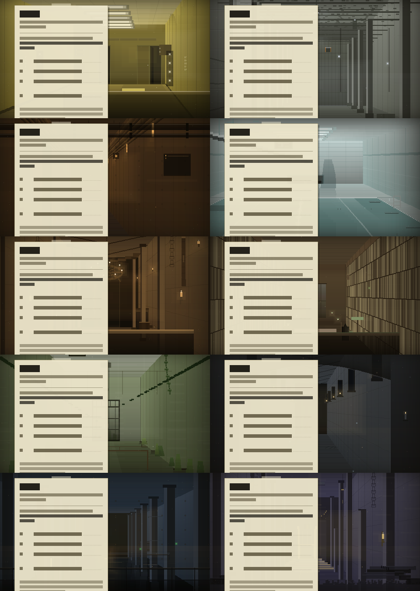

# Jobs · Aviso a los ocupantes

Mod **de cliente** que reemplaza los menús de Minecraft por los del servidor **Jobs**: un aviso fotocopiado
y pegado con cinta a la pared de un pasillo amarillo que no se termina. Dice en qué nivel estás, cuánto
cuesta la salida al siguiente, y cuánto falta para la próxima ronda de los **Executores**.

Al fondo del pasillo hay un vano oscuro. Cada tanto algo lo cruza.

El fondo va cambiando de nivel solo. Entre uno y otro se corta la luz.

No añade objetos, ni entidades, ni mecánicas. Sólo cambia lo que ves antes de entrar a trabajar.



| | |
|---|---|
| Versión | **0.10.0** |
| Minecraft | 1.20.1 |
| Forge | 47.x |
| Java | 17 |
| Lado | Cliente (el servidor no necesita el mod) |

## Qué trae la 0.10.0

Esta es la versión actual de Jobs Menu. No cambia pantallas de mods ajenos ni
toca el mundo: concentra el trabajo en el ciclo de vida del menú, el audio, la
accesibilidad y la legibilidad de sus diez recintos.

- **Transición coherente por frame.** La escena captura nivel, luz y estado del
  apagón en un mismo instante. La planta, el papel y los eventos ya no pueden
  cruzar la frontera de un nivel en momentos distintos.
- **Accesibilidad respetada.** Movimiento reducido congela la animación completa;
  destellos reducidos conserva la lectura sin parpadeos. Los controles mantienen
  sus hitboxes nativas, entran en Tab y tienen narración vanilla.
- **Audio con lifecycle controlado.** El tema del menú tiene una única instancia,
  depende de `Master` y del volumen del aviso, sobrevive a Opciones/Mods y se
  invalida al recargar recursos o entrar a un mundo. Las camas ambientales se
  detienen sin quedar huérfanas y los eventos respetan silencio y ducking.
- **Personalización útil.** Se añadieron volumen maestro del aviso con M,
  rotación en calma (24 s o 48 s) y fecha del turno. Los cambios de configuración
  se aplican al instante y se guardan con límite de escritura, también al salir.
- **La Suspensión.** Una vez cada aproximadamente 45–52 minutos, el edificio
  queda a oscuras durante 22 segundos: la luz baja sin parpadeos, el ambiente se
  reduce a su respiración más baja, la música cede y el rótulo avisa que el
  edificio suspira. Es un evento raro del fondo, no una mecánica ni un susto.
- **Diez funciones nuevas de percepción.** Alto contraste, texto grande, papel
  limpio, guía de lectura, estado de instalación, respiración de cámara
  independiente, duración configurable de avisos, presencia y eventos
  ambientales separables, y control de La Suspensión. Todo se integra en la
  pantalla de Opciones nativa y conserva los valores por defecto anteriores.
- **Fondos revisados individualmente.** Los diez niveles conservan arquitectura
  propia, materiales distinguibles, luz principal, rebotes y un punto focal. El
  Trono fue ajustado para que el ábside, el haz cenital, las columnas y el
  estrado conduzcan la mirada hacia un asiento vacío realmente legible.
- **Entrega verificable.** La auditoría estática, el procedimiento reproducible de
  compilación y el informe de compatibilidad están sincronizados con Forge 47.x,
  Java 17 y el nombre real del JAR. La evolución vigente está en
  [`docs/EVOLUCION_6.md`](docs/EVOLUCION_6.md) con su catálogo
  [`docs/CATALOGO_MEJORAS_Y_FUNCIONES.md`](docs/CATALOGO_MEJORAS_Y_FUNCIONES.md)
  y su informe final [`docs/INFORME_FINAL_EVOLUCION_6.md`](docs/INFORME_FINAL_EVOLUCION_6.md).
  El historial de decisiones está en
  [`docs/PROPUESTA_EVOLUCION_2.md`](docs/PROPUESTA_EVOLUCION_2.md) y
  [`docs/EVOLUCION_4.md`](docs/EVOLUCION_4.md).

## Evolución reciente

La etapa 1 añadió duración de estancia configurable, salto manual de nivel,
perfil accesible, modo de bajo consumo y continuidad del ambiente al navegar
pantallas hijas. La etapa 2 dio a cada uno de los diez fondos una mejora
artística propia (una fila implementada por escenario en la matriz de
auditoría de fondos) y rediseñó el Trono desde cero. Build con Java 17 y
prueba en Minecraft pendientes: ver [`KNOWN_ISSUES.md`](KNOWN_ISSUES.md).

## Historial resumido

Las versiones anteriores añadieron los diez recintos, la pausa tematizada, la
ruta de música local, las camas ambientales, el Trono y la primera auditoría
profesional. El detalle histórico que todavía importa está en
[`CHANGELOG.md`](CHANGELOG.md); este README conserva sólo el estado vigente para
evitar instrucciones antiguas o afirmaciones desactualizadas sobre REQUIEM.

## Compilar

Requiere JDK 17 instalado.

```powershell
.\gradlew.bat clean build --no-daemon
```

El `.jar` queda en `build\libs\jobsmenu-0.10.0.jar` y se copia a la carpeta `mods` de la instancia.

> El repositorio incluye `gradle\wrapper\gradle-wrapper.jar` (Gradle 8.1.1), así
> que un clon normal trae el wrapper completo. `gradlew.bat` descarga la
> distribución Gradle solo si no está en la caché local.

> **Si el build falla por memoria** (`os::commit_memory ... failed (errno=1455)` o *the daemon has
> disappeared*), no es el mod: es que a Windows le falta memoria comprometible. El `gradle.properties` ya va
> contenido a propósito (heap chico, GC serial, sin paralelismo) y `build.gradle` limita el proceso de
> reobfuscación, así que suele alcanzar. Si aun así falla, agrandá el **archivo de paginación** de Windows
> (Ver configuración avanzada del sistema → Rendimiento → Opciones avanzadas → Memoria virtual → Cambiar →
> tamaño administrado por el sistema) y reiniciá. El build tiene que terminar en **`BUILD SUCCESSFUL`**: si
> dice `BUILD FAILED`, el `.jar` que quede está a medio hacer y no sirve.

## Compilar y desplegar en la instancia `test-1`

Abrí una **terminal PowerShell nueva**, ubicáte en el repositorio y pegá el
bloque completo de abajo **de una sola vez** (un solo Ctrl+V, sin partirlo).
**No se guarda como archivo `.ps1`** y **no se pega línea por línea**: el código
se ejecuta una sola vez en esa terminal.

El bloque es deliberadamente conservador: no cambia de rama, no hace merge con
`main`, no borra nada hasta encontrar y validar el JAR correcto, y no informa
éxito si un comando anterior falló. La rama correcta de esta evolución es
`arena/01a04ff1-jobs-menu`; una rama parecida como `arena/01a04e24-jobs-menu`
o `arena/01a04e0d-jobs-menu` corresponde a otro snapshot y debe detener el
proceso antes de compilar.

Todo el bloque es **un único `try/catch`**: el primer paso que falle corta la
ejecución en ese punto, imprime `FALLO: ...` y no toca nada de `mods`. Además,
antes de compilar hace `git fetch origin` y frena si tu checkout no está al día
con la rama publicada, para que un checkout viejo no se compile por error.

Rutas usadas:

```text
Repositorio: C:\Users\santi\Desktop\Jobs---Menu
Instancia:  C:\Users\santi\AppData\Roaming\.sklauncher\instances\test-1
JAR:        build\libs\jobsmenu-0.10.0.jar
```

El despliegue es por fases y verificado por hash: el JAR nuevo entra primero a
`mods` con nombre `.pendiente` (el launcher ignora lo que no termina en `.jar`),
se compara su SHA256 con el compilado, recien entonces se respaldan y borran los
JARs anteriores, y el `.pendiente` pasa a su nombre final. Nunca hay una ventana
con cero JARs ni dos JARs activos a la vez. El bloque usa solo ASCII para no
depender de la pagina de codigos de la consola.

```powershell
$ErrorActionPreference = "Stop"

# BLOQUE UNICO: pegarlo entero de una sola vez en una terminal nueva. Es un
# unico try/catch: el primer fallo corta todo y no se despliega nada.
try {

# --- 0. Rutas y rama; no se cambia ni se actualiza main -----
$repo            = "C:\Users\santi\Desktop\Jobs---Menu"
$instancia       = "C:\Users\santi\AppData\Roaming\.sklauncher\instances\test-1"
$branch          = "arena/01a04ff1-jobs-menu"
$versionEsperada = "0.10.0"
$hashNuevo = $null
$hashPendiente = $null

if (-not (Test-Path (Join-Path $repo "gradle.properties") -PathType Leaf)) {
    throw "No encuentro el repositorio en $repo"
}
if (-not (Test-Path $instancia -PathType Container)) {
    throw "No encuentro la instancia test-1 en $instancia"
}
if (-not (Test-Path (Join-Path $repo "gradlew.bat") -PathType Leaf)) {
    throw "No encuentro gradlew.bat en $repo"
}
if (-not (Test-Path (Join-Path $repo "gradle\wrapper\gradle-wrapper.jar") -PathType Leaf)) {
    throw "Falta gradle\wrapper\gradle-wrapper.jar. El wrapper no puede arrancar; " +
          "revisa el checkout: el archivo esta versionado en la rama."
}
if (-not (Get-Command git.exe -ErrorAction SilentlyContinue)) {
    throw "git no esta en el PATH. No puedo verificar la rama."
}

Set-Location $repo

# Rama: --show-current (git >= 2.22) con respaldo para versiones viejas.
$actual = (git branch --show-current 2>$null | Out-String).Trim()
if (-not $actual) {
    $actual = (git rev-parse --abbrev-ref HEAD 2>$null | Out-String).Trim()
}
if ($actual -ne $branch) {
    throw "La rama actual es '$actual'. No compilo ni despliego. Usa la rama publicada '$branch'."
}

# Al dia con lo publicado: compilar un checkout viejo ya causo un error.
git fetch origin 2>$null
if ($LASTEXITCODE -ne 0) {
    throw "git fetch fallo. Sin red no puedo verificar que la rama este al dia."
}
$local  = (git rev-parse HEAD | Out-String).Trim()
$remota = (git rev-parse origin/$branch | Out-String).Trim()
if ($remota -and $local -ne $remota) {
    throw "Checkout desactualizado: local $local vs publicado $remota. " +
          "Ejecuta 'git pull origin $branch' y pega el bloque de nuevo."
}

$dirty = @(git status --porcelain)
if ($dirty.Count -gt 0) {
    throw "El repositorio tiene cambios locales. Guardalos o confirmalos antes de compilar."
}

# --- 1. Version del proyecto -----
$versionLine = Get-Content .\gradle.properties |
    Where-Object { $_ -match '^mod_version=(.+)$' } |
    Select-Object -First 1
if (-not $versionLine) {
    throw "No pude leer mod_version de gradle.properties"
}
$version = ($versionLine -replace '^mod_version=', '').Trim()
if ($version -ne $versionEsperada) {
    throw "La version encontrada es $version; este despliegue espera $versionEsperada."
}

# --- 2. JDK 17: gradlew.bat usa JAVA_HOME; si no, el java del PATH ----
if ($env:JAVA_HOME) {
    $jhJava = Join-Path $env:JAVA_HOME "bin\java.exe"
    if (-not (Test-Path $jhJava -PathType Leaf)) {
        throw "JAVA_HOME apunta a '$env:JAVA_HOME' pero no tiene bin\java.exe."
    }
    if (-not (Test-Path (Join-Path $env:JAVA_HOME "bin\javac.exe") -PathType Leaf)) {
        throw "JAVA_HOME no tiene bin\javac.exe; hace falta un JDK, no un JRE."
    }
    try {
        $javaText = (& $jhJava -version 2>&1 | Out-String).Trim()
    } catch {
        $javaText = $_.Exception.Message
    }
    if ($javaText -notmatch 'version "17\.') {
        throw "JAVA_HOME apunta a un Java que no es 17:`n$javaText"
    }
} else {
    $java = Get-Command java.exe -ErrorAction SilentlyContinue
    if (-not $java) {
        throw "No hay JAVA_HOME y java no esta en el PATH. Instala o activa un JDK 17."
    }
    if (-not (Get-Command javac.exe -ErrorAction SilentlyContinue)) {
        throw "Sin JAVA_HOME hace falta un JDK 17 completo en el PATH (no encontre javac)."
    }
    try {
        $javaText = (& $java.Source -version 2>&1 | Out-String).Trim()
    } catch {
        $javaText = $_.Exception.Message
    }
    if ($javaText -notmatch 'version "17\.') {
        throw "Se encontro Java distinto de 17:`n$javaText"
    }
}
Write-Host $javaText -ForegroundColor Green

# --- 3. Python real (sin los alias de Microsoft Store) -----
$py = Get-Command py.exe -ErrorAction SilentlyContinue
$python = Get-Command python.exe -ErrorAction SilentlyContinue
$verSalida = $null

if ($py -and $py.Source -notlike '*\WindowsApps\*') {
    $verSalida = & $py.Source -3 tools\verificar.py 2>&1
} elseif ($python -and $python.Source -notlike '*\WindowsApps\*') {
    $verSalida = & $python.Source tools\verificar.py 2>&1
} else {
    throw "Python no esta instalado. Instala Python 3 y vuelve a ejecutar el bloque."
}

if ($LASTEXITCODE -ne 0) {
    throw "tools\verificar.py fallo (exit $LASTEXITCODE):`n$($verSalida | Out-String)"
}

# --- 4. Compilacion limpia ----
& .\gradlew.bat clean build --no-daemon
if ($LASTEXITCODE -ne 0) {
    throw "La compilacion fallo (exit $LASTEXITCODE). No se desplegara ningun JAR."
}

$jar = Join-Path $repo "build\libs\jobsmenu-$version.jar"
if (-not (Test-Path $jar -PathType Leaf)) {
    $producidos = @(Get-ChildItem (Join-Path $repo "build\libs") -Filter "jobsmenu-*.jar" -File -ErrorAction SilentlyContinue)
    $lista = if ($producidos.Count) { ($producidos.Name -join ', ') } else { '(ninguno)' }
    throw "No aparece el JAR esperado $jar. JARs encontrados: $lista"
}
if ((Get-Item $jar).Length -le 0) {
    throw "El JAR esperado esta vacio: $jar"
}
$hashNuevo = (Get-FileHash -LiteralPath $jar -Algorithm SHA256).Hash

# --- 5. Despliegue por fases; Minecraft cerrado -----
$mods = Join-Path $instancia "mods"
New-Item -ItemType Directory -Force -Path $mods | Out-Null
$stamp = Get-Date -Format "yyyyMMdd-HHmmss"
$backupDir = Join-Path $instancia "jobsmenu-backups\$stamp"
New-Item -ItemType Directory -Force -Path $backupDir | Out-Null

# 5.1 Config actual, por si hace falta volver atras.
$config = Join-Path $instancia "config\jobsmenu-client.toml"
if (Test-Path $config -PathType Leaf) {
    Copy-Item -LiteralPath $config -Destination (Join-Path $backupDir "jobsmenu-client.toml") -Force
}

# 5.2 El JAR nuevo entra como .pendiente: el launcher ignora lo que no acaba en .jar.
$nombreJar = "jobsmenu-$version.jar"
$pendiente = Join-Path $mods "$nombreJar.pendiente"
Copy-Item -LiteralPath $jar -Destination $pendiente -Force
$hashPendiente = (Get-FileHash -LiteralPath $pendiente -Algorithm SHA256).Hash
if ($hashPendiente -ne $hashNuevo) {
    Remove-Item -LiteralPath $pendiente -Force
    throw "La copia a mods no coincide con el JAR compilado. Aborto sin tocar los JARs actuales."
}

# 5.3 JARs anteriores: primero al backup, despues se borran.
$anteriores = @(Get-ChildItem -LiteralPath $mods -Filter "jobsmenu-*.jar" -File -ErrorAction SilentlyContinue)
foreach ($viejo in $anteriores) {
    # FullName evita resolver el nombre contra el directorio actual.
    Copy-Item -LiteralPath $viejo.FullName -Destination (Join-Path $backupDir $viejo.Name) -Force
}
foreach ($viejo in $anteriores) {
    Remove-Item -LiteralPath $viejo.FullName -Force
}

# 5.4 El JAR nuevo pasa a su nombre final y se verifica de nuevo.
$final = Join-Path $mods $nombreJar
Move-Item -LiteralPath $pendiente -Destination $final -Force
if ((Get-FileHash -LiteralPath $final -Algorithm SHA256).Hash -ne $hashNuevo) {
    throw "La verificacion final del JAR desplegado fallo. Revisa $mods"
}

$commit = (git rev-parse --short HEAD | Out-String).Trim()
Write-Host "OK: desplegado $nombreJar en $mods" -ForegroundColor Green
Write-Host "Commit : $commit"
Write-Host "Backup : $backupDir"
Write-Host "SHA256 : $hashNuevo"

} catch {
    Write-Host ""
    Write-Host ("FALLO: " + $_.Exception.Message) -ForegroundColor Red
    Write-Host "Nada se desplego. Corregi el motivo y pega el bloque entero de nuevo."
}
```

Si falla la rama, la actualización, Java, Python, la auditoría, Gradle o el
artefacto, el bloque imprime `FALLO: ...` y termina sin tocar los JARs
existentes. El hash del `.pendiente` y el del JAR final se comparan con el
compilado; un archivo corrupto aborta antes de borrar nada. No copies backups a
`mods`. Si el mensaje pide `git pull`, actualizá la rama y pegá el bloque entero
de nuevo.

## Herramientas sin JDK

```powershell
python tools\verificar.py       # versiones, idiomas, JSON, ASCII, llaves, símbolos, audio y niveles
python tools\vista_previa.py    # dibuja el menú a PNG para revisar la escena
python tools\vista_previa.py --contacto docs\contacto-actual.png   # los diez niveles juntos
python tools\vista_previa.py --presencia docs\presencia.png     # la manifestación del fondo, paso a paso
python tools\sonidos.py         # regenera las 73 piezas sintetizadas (74 OGG con la música; requiere numpy, scipy y soundfile)
```

## Documentación

Todo el diseño —canon del servidor, identidad, paleta, voz, alcance por fases y reglas de trabajo— está en
[`CONTEXTO.md`](CONTEXTO.md). Para la entrega de esta evolución: [`CHANGELOG.md`](CHANGELOG.md),
[`KNOWN_ISSUES.md`](KNOWN_ISSUES.md), [`docs/EVOLUCION_6.md`](docs/EVOLUCION_6.md),
[`docs/PLAN_EVOLUCION_6.md`](docs/PLAN_EVOLUCION_6.md),
[`docs/CATALOGO_MEJORAS_Y_FUNCIONES.md`](docs/CATALOGO_MEJORAS_Y_FUNCIONES.md),
[`docs/INFORME_FINAL_EVOLUCION_6.md`](docs/INFORME_FINAL_EVOLUCION_6.md),
[`docs/DIRECCION_ARTISTICA.md`](docs/DIRECCION_ARTISTICA.md),
[`docs/FONDOS_EXPLICADOS.md`](docs/FONDOS_EXPLICADOS.md),
[`docs/checklist-manual.md`](docs/checklist-manual.md), [`docs/compatibilidad.md`](docs/compatibilidad.md),
[`docs/musica.md`](docs/musica.md) y [`docs/AUDITORIA_FONDOS_50X10.md`](docs/AUDITORIA_FONDOS_50X10.md).
